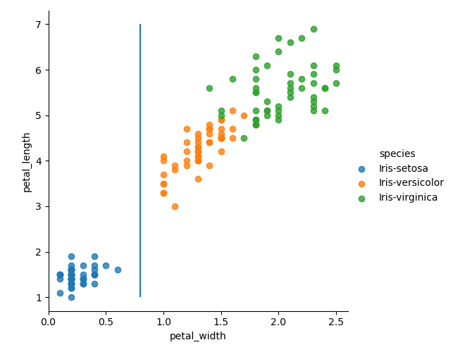
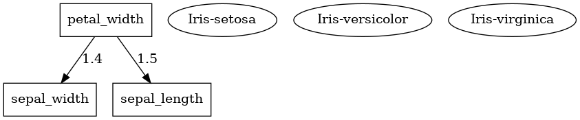

# APPRENTISSAGE AUTOMATIQUE - CLASSIFIEUR

Ce projet à pour but d'implémenter un classifieur avec l'algorithme de l'arbre de décision (qui est un algorithme d'apprentissage automatique supervisé).

Le gain d'information a été utilisé comme critère de sélection.

## PRINCIPALES ÉTAPES RÉALISÉES

| PRINCIPALES TÂCHES | DESCRIPTION |
|--------------------|-------------|
| **1. Charger, Lire, <a href="#visualize">Visualiser</a>, Préparer et Répartir les Données** | Faire appel Pandas les fichiers CSV.|
| **2. Apprentissage** | Utiliser le classifieur d'arbre de décision |
| **3. Prédiction** | Faire des prédictions sur un jeu de données fourni. |
| **4. Évaluation** | Évaluer les performances du classifieur avec de la donnée dédiée au test |

**<a id="visualize">Visualiser</a>**

### DÉPENDANCES

- [Numpy](https://numpy.org/)
- [Pandas](https://pandas.pydata.org/)
- [Matplotlib](https://matplotlib.org/)
- [Seaborn](https://seaborn.pydata.org/)
- [Graphviz](https://graphviz.org/)
- [Pydotplus](https://pypi.org/project/pydotplus/)

#### RESSOURCES

- <https://www.youtube.com/watch?v=y6DmpG_PtN0&list=PLPOTBrypY74xS3WD0G_uzqPjCQfU6IRK->
- <https://www.geeksforgeeks.org/decision-tree-implementation-python/?ref=lbp>
- <https://www.geeksforgeeks.org/getting-started-machine-learning/>
- <https://www.youtube.com/watch?v=RmajweUFKvM>
