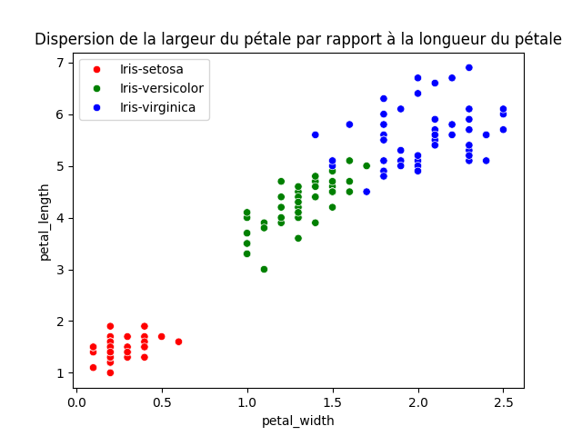

# MACHINE LEARNING - CLASSIFIER

This project aims to implement a classifier with the decision tree algorithm (which is a supervised machine learning algorithm).

Information gain was used as a selection criterion.

To run the program:

```bash
$ ls
data  doc  main.py  my_module  README.md
$ python3 main.py
```

## PRINCIPALES ÉTAPES RÉALISÉES

| MAIN TASKS | ABOUT THE TASK |
|--------------------|-------------|
| **1. Load, Read, <a href="#visualize">View</a>, Prepare and Distribute Data** | Use Pandas for CSV files.|
| **2. Learning** | Use decision tree classifier |
| **3. Prediction** | Make predictions on given dataset. |
| **4. Rating** | Rate classifier performance with test data |

**<a id="visualize">View</a>**




### DÉPENDENCES

- [Numpy](https://numpy.org/)
- [Pandas](https://pandas.pydata.org/)
- [Matplotlib](https://matplotlib.org/)
- [Seaborn](https://seaborn.pydata.org/)
- [Graphviz](https://graphviz.org/)
- [Pydotplus](https://pypi.org/project/pydotplus/)
- [Time](https://docs.python.org/fr/3/library/time.html)
- [Psutil](https://pypi.org/project/psutil/)

#### RESOURCES

- <https://www.youtube.com/watch?v=y6DmpG_PtN0&list=PLPOTBrypY74xS3WD0G_uzqPjCQfU6IRK->
- <https://www.geeksforgeeks.org/decision-tree-implementation-python/?ref=lbp>
- <https://www.geeksforgeeks.org/getting-started-machine-learning/>
- <https://www.youtube.com/watch?v=RmajweUFKvM>
